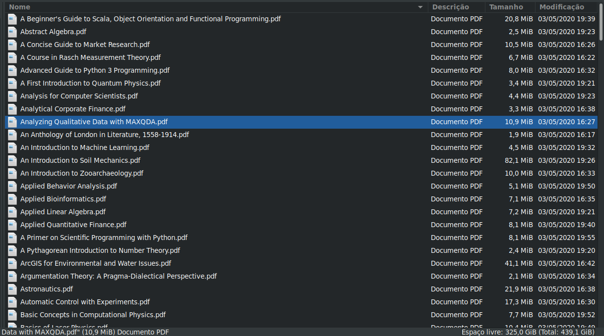

# Download Books Springer
Em meio a muitas incertezas e informações que o surto de coronavírus esta causando,
a [Spring Nature](https://www.springernature.com/br) disponibilizou gratuitamente uma
série de livros essenciais de todas as diciplinas para ajudar e apoiar estudantes e 
instrutores em todo mundo.

Pensando no trabalho de ter que baixar todos esses livros, esse repositório contém scripts ***Python***
para facilitar fazer o download, sem ter o trabalho de entrar em cada livro e baixa-lo.

## Instalação

#### Requisitos:

- Python >= 3.6
- Python-venv

```sh
$ git clone https://github.com/lucasmcast/DownloadBookSpringer.git
$ cd DownloadBookSpringer
$ python3 -m venv venv
```
#### Ativar ambiente virtual:

Linux:
```$ source venv/bin/activate```

Windows
```> venv\Scripts\activate```

#### Instalar dependências:

```(venv) pip install -r requeriments.txt```

### Execução

```$ python3 download_files.py -p <caminho_download>```


